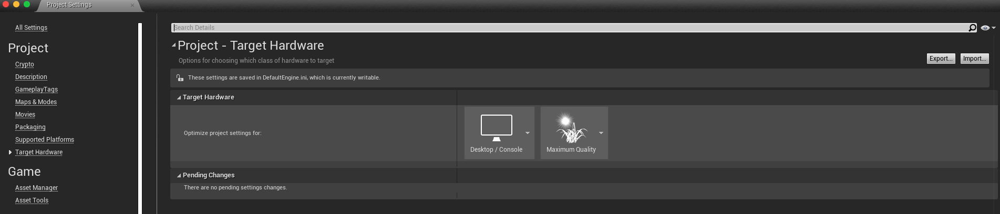
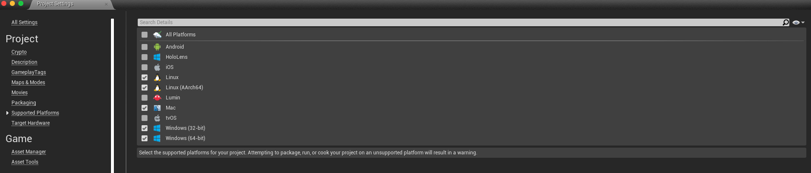

# :video_game::robot::wrench::hammer: Mech Combat Game :hammer::wrench::robot::video_game:

# Table of Contents

- [Introduction](#introduction)
- [Supported Platforms](#supported-platforms)
- [Environment](#environment)
  - [Forest Environment](#forest-environment)
  - [Player Base](#player-base)
- [How To Play](#how-to-play)
  - [Controls](#controls)
  - [Shop Menu](#shop-menu)
  - [Heads Up Display](#heads-up-display)
- [Your Character](#your-character)
  - [The Robo Dude](#the-robo-dude)
  - [The Hammer](#the-hammer)
- [Enemies](#enemies)
  - [Bomb Spiders](#bomb-spiders)
  - [Turret Spiders](#turret-spiders)
- [Items](#items)
  - [Time Fragments](#time-fragments)
- [Abilities](#abilities)
  - [Whirlwind Attack](#whirlwind-attack)
  - [Helicopter Attack](#helicopter-attack)
  - [Leap Attack](#leap-attack)
- [Building the Development Environment](#building-the-development-environment)
- [Packaging the Game for Production](#packaging-the-game-for-production)
- [Contributing Guidelines](#contributing-guidelines)
- [License](#license)
- [Acknowledgements](#acknowledgements)

---

## Introduction

Welcome to my Mech Combat Game! This is my first attempt at game development using Epic Game's [Unreal Engine](https://www.unrealengine.com/en-US/). It is a simple wave-based action arcade game where you control a robot and destrot mechanical spiders. If you would like to test play this game, you can either follow the instructions for [Packaging the Game for Production](#packaging-the-game-for-production) if you have the Unreal Engine, or downloading the executable from my [Dropbox link](https://www.dropbox.com/s/lmxd86qttlguv6x/MechCombat.zip?dl=0). If neither of those options worked, feel free to [create an issue](https://github.com/toyaokeke/MechCombatGame/issues) or [contact me directly](https://toyaokeke.github.io/#contact) for a copy of the game. I hope you enjoy playing! :smile:

## Supported Platforms

- Windows (32-bit)
- Windows (64-bit)
- MacOS
- Linux
- Linux (AArch64)

**IMPORTANT:** This is a desktop based game. It was not developed for gaming consoles or mobile devices. Attempting to play this game on unsupported devices will generate a warning from the game and may result in other unexpected errors.

## Environment

### Forest Environment

The main level where game exist is currently a forest environment. It is an open world environment containing bushes, trees, logs, etc. Enemies will be spawned into the environment in waves and the player will roam the area and try to survive and kill each wave of enemies.

### Player Base

The player base is your home inside the forest environment. In your player base, this is where you will be able to upgrade your character's base stats, special attacks, and other things.

## How To Play

### Controls

To game can be played with a mouse and keyboard. The different controls are shown below:

### Shop Menu

The shop menu is where you can upgrade your character when you approach the workbench in your player base. You can find a sample of the shop menu below:

### Heads Up Display

The heads up display (HUD) is where you will see your character's health, stamina, attack energy and other things. The full view of the HUD is shown below:

## Your Character

### The Robo Dude

This is your character. It is a a humanoid robot that lives inside your forest environment and fends off mechanical spiders. It is not strong enough to destroy spiders with its hands, so it carries a sturdy hammer everywhere it goes in case it runs into spiders in the forest.

### The Hammer

This is your robo dude's hammer. It is very strong and durable and capable of smashing pesky mechanical spiders. Without this hammer, the robo dude would not survive in the forest environment with all these spiders lurking about.

## Enemies

### Bomb Spiders

There are two types of spiders the robo dude encounters in its forest. One of them is the bomb spider. These spiders are harmless from afar, but very dangerous if they get close. Once they spot their target and get close to them, the bombs mounted on them active and explode. If your robo dude is within the blast range of this explosion it can deal serious damage.

### Turret Spiders

The other spider that your robo dude sees in its forest is the turret spider. These spiders are not as lethal as the bomb spider, but can still be quite dangerous. These spiders are mounted with turrets that fire off explosive projectiles. These projectiles will damage your robo dude, but not as much as much as the bomb spiders. However, since these turret spiders are long range enemies, they don't have to get close to hurt you, so watch out!

## Items

### Time Fragments

Each time your robo dude kills a spider, they drop a shiny crystal called a time fragment. These fragments can be used to upgrade your robo dude's basic stats, attacks and other things.

## Abilities

### Whirlwind Attack

When your robo dude performs a whirlwind attack, it will spin itself and swing its hammer at high speed, damaging all enemies around it in the process

### Helicopter Attack

For the helicopter attack, your robo dude will rapidly spin its wrist while holding its hammer. This attack damages all enemies directly in front of the robo dude.

### Leap Attack

The leap attack is most lethal attack in the robo dude's arsenal. It will propel itself into air towards its enemies and deliver a crushing swing to anything in its way.

**IMPORTANT:** In order to run this project in development or package for production, you will need to create an Epic Games account and download the Unreal Engine on your machine. Please visit the [Unreal Engine](https://www.unrealengine.com/en-US/) for further instructions.

**NOTE:** The instructions I am providing are based on MacOS. These steps may differ for Windows and Linux machines

## Building the Development Environment

1. Open the Epic Games Launcher and click `Launch Unreal Engine 4.x.x`. It should look like the following:

2. When the Unreal Project Browser shows, follow these steps:

- Click the `More` button

- Click `Browse`

- Locate where you saved this repository on your machine and select `MechCombatGame.uproject`

- Click `Open Project`

**NOTE:** If you have opened this project before, you can also select it from your Recent Projects List

3. This should now open the main level of the game. From here, you can browse through the blueprint code, skeletal meshes and all other assets using the Content Browser at the bottom

## Packaging the Game for Production

1. In **_BOTH_** the `Level1` and `MainMenu` levels, make sure the light quality is set to `Production` and click `Build`. This may take a few minutes depending on the performance of your machine

2. In the `Project Settings`, make sure the `Maps & Modes` settings are the same as below:

3. In the `Project Settings`, make sure the `Input` settings are correct based on any changes made to the game. Below is an example:

4. In the `Project Settings`, make sure the `Target Hardware` settings are the same as below:

5. In the `Project Settings`, make sure the `Supporting Platforms` settings are the same as below:

6. In the `Project Settings`, make sure the `Packaging` settings are the same as below:

7. Once you have completed the above steps, select `File/Package Project/<your OS>`. This process may take several minutes depending on the performance of your machine. Below is an example:

**IMPORTANT:** When asked for a location, be sure to select a folder that you will remember the location of. For example, you can create a folder on your `Desktop` called `MechCombat` and select that folder to export everything to.

8. In the folder you exported the project to, there should be an executable file containing the game. Congrats, you've just finished creating the game!

**NOTE:** Be sure to zip the folder so that the content is compressed before sharing this game with your peers.

**NOTE:** If any errors occur during the packaging process, be sure to carefully read the output log that is generated by the Unreal Engine

## Contributing Guidelines

More to come shortly

## License

This project is released under the [Apache 2.0 License](LICENSE)

## Acknowledgements

Thank you to [Dev Squad Academy](https://www.devsquadacademy.com/) for providing me with tutorials to build this game :heart:

Please also check these [additoinal resources](docs/RESOURCES.md) for more.
